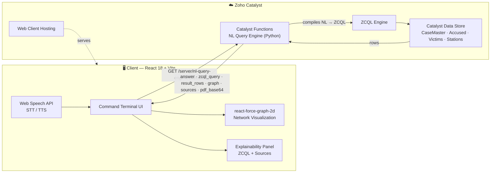

<div align="center">

# 🚨 KSP Crime Intelligence Command Terminal

### Conversational AI & Dynamic Network Graph Engine for Police Crime Databases

**Karnataka State Police · Datathon 2026**

[](https://www.catalyst.zoho.com/)
[](#)
[](#)
[](#)
[](#)

<br/>

*A natural-language command terminal for live police crime databases — ask a question in English or Kannada, and get a synthesized answer, a live network graph of the people and cases involved, a full audit trail of the exact database rows used, and an instant PDF intelligence report.*

</div>

---

## 📖 Table of Contents

- [Overview](#-overview)
- [Core Capabilities](#-core-capabilities)
- [Architecture](#️-architecture)
- [Tech Stack](#-tech-stack)
- [API Specification](#-api-specification)
- [Network Graph Schema](#-network-graph-schema)
- [Getting Started](#-getting-started)
- [Project Structure](#-project-structure)
- [Roadmap](#-roadmap)
- [Team](#-team)

---

## 🎯 Overview

Police investigators routinely need to cross-reference **cases, accused persons, victims, stations, and locations** buried across relational crime databases — a process that traditionally requires SQL literacy, manual joins, and static reports.

The **KSP Crime Intelligence Command Terminal** replaces that workflow with a single conversational interface. An investigator types (or speaks) a question in **English or Kannada**, and the system:

1. Compiles the question into a live **ZCQL** query against the Zoho Catalyst data store,
2. Synthesizes a plain-language answer,
3. Extracts every entity and relationship touched by the query into an **interactive network graph**,
4. Surfaces the **exact source rows** used, for full explainability, and
5. Generates a **downloadable PDF intelligence report** on demand.

Every response is fully auditable — nothing is presented to an investigator without a visible trail back to the underlying record.

---

## ✨ Core Capabilities

| # | Capability | Description |
|---|---|---|
| 1 | 🧠 **Conversational ZCQL Compiler** | Transforms natural language (English & Kannada) directly into optimized **ZCQL** queries, executed live against the police database — no SQL knowledge required. |
| 2 | 🕸️ **Dynamic Network Graph Extraction** | Parses query response entities into an interactive 2D force-directed graph (`react-force-graph-2d`), color-coded by entity type: **Cases** 🔵 Blue · **Accused** 🔴 Red · **Victims** 🟢 Green · **Police Stations** 🟠 Amber · **Locations** 🟣 Violet. |
| 3 | 🇮🇳 **Native Bilingual Support (ಕನ್ನಡ + English)** | Full native support for Kannada-language queries *and* Kannada-language AI-generated insights — not a translation layer bolted on top. |
| 4 | 🎙️ **Browser-Native Voice AI (STT & TTS)** | Hands-free operation via the Web Speech API — speak a query, hear the answer read back, no external voice service required. |
| 5 | 📄 **On-the-Fly PDF Intelligence Reports** | Automated base64 PDF generation attached directly to query results for instant download — case briefs, ready to file. |
| 6 | 🔍 **Audit Trail Explainability** | Every answer ships with row-level source citations — the exact database records the AI used to synthesize its response, plus the raw ZCQL query itself. |
| 7 | 📈 **Predictive Crime Trend Analysis** | Surfaces pattern hotspots, charge-sheet timelines, and station-wise crime distribution trends directly from conversational queries. |

---

## 🏗️ Architecture



**Request lifecycle:**

1. Investigator submits a query (typed or spoken) in English or Kannada.
2. Frontend issues a `GET` request to the live **NL Query Engine** endpoint on Catalyst Functions.
3. The engine compiles the natural-language question into a **ZCQL** statement and executes it against the Catalyst Data Store.
4. The response is returned with a synthesized answer, the raw query, the result rows, an extracted entity graph, source citations, and (optionally) a base64-encoded PDF.
5. The frontend renders the answer in-chat, plots the graph, and populates the explainability panel — all from a single round trip.

---

## 🛠️ Tech Stack

<table>
<tr>
<td valign="top" width="50%">

**Frontend**
- ⚛️ React 18
- ⚡ Vite
- 🎨 Custom Vanilla CSS — Glassmorphism Design System
- 🕸️ `react-force-graph-2d` (Canvas-based network graph)
- 🎯 Lucide React (icon system)
- 🎙️ Web Speech API (native browser STT/TTS)

</td>
<td valign="top" width="50%">

**Backend & Infrastructure**
- 🐍 Python (FastAPI-style NL Query Engine)
- ⚙️ Zoho Catalyst Functions (serverless compute)
- 🗄️ Zoho Catalyst Data Store
- 🔎 ZCQL (Zoho Catalyst Query Language)
- 🌐 Zoho Catalyst Web Client Hosting

</td>
</tr>
</table>

---

## 📡 API Specification

### `GET /server/nl-query-engine/execute`

Executes a natural-language query against the live crime database and returns a synthesized answer, its underlying ZCQL query, extracted network graph, and full source audit trail.

#### Query Parameters

| Parameter | Type | Required | Description |
|---|---|---|---|
| `question` | `string` | ✅ Yes | The user's natural language question, URL-encoded. Supports English and Kannada. |
| `conversation_id` | `string` | ❌ No | Session ID used to maintain continuous conversational context across turns. Omit on the first message. |
| `export_pdf` | `boolean` | ❌ No | Set to `true` to additionally generate and attach a base64-encoded PDF intelligence report. |

#### Example Request

```
GET https://ksp-datathon-60078827774.development.catalystserverless.in/server/nl-query-engine/execute?question=How%20many%20cases%20are%20charge%20sheeted&export_pdf=true
```

#### Response Schema

```json
{
  "conversation_id": "conv-xxxx",
  "answer": "There are 26 cases charge sheeted in the selected timeframe...",
  "zcql_query": "SELECT * FROM CaseMaster WHERE Status = 'Charge Sheeted'",
  "result_rows": [
    {
      "CrimeNo": "FIR/2024/089",
      "BriefFacts": "Suspect apprehended near MG Road..."
    }
  ],
  "graph": {
    "nodes": [
      { "id": "case_1", "label": "FIR/2024/089", "type": "Case" },
      { "id": "accused_1", "label": "Ramesh Kumar", "type": "Accused" }
    ],
    "edges": [
      { "source": "accused_1", "target": "case_1", "label": "accused_in" }
    ]
  },
  "sources": ["Table CaseMaster: CaseMasterID=123"],
  "pdf_base64": "JVBERi0xLjM..."
}
```

#### Response Fields

| Field | Type | Description |
|---|---|---|
| `conversation_id` | `string` | Session identifier — persist and pass back on follow-up queries for continuous context. |
| `answer` | `string` | Plain-language synthesized answer, rendered directly in the chat UI. |
| `zcql_query` | `string` | The exact ZCQL statement executed — shown in the Explainability panel. |
| `result_rows` | `array` | Raw rows returned by the query, keyed by source table. |
| `graph.nodes` | `array` | Extracted entities (`Case`, `Accused`, `Victim`, `Station`, `Location`) for network visualization. |
| `graph.edges` | `array` | Relationships between extracted entities. |
| `sources` | `array` | Row-level citations proving which records the answer was derived from. |
| `pdf_base64` | `string` | *(optional)* Base64-encoded PDF intelligence report, present only when `export_pdf=true`. |

#### Error Shape

```json
{
  "error": "Unable to parse query intent",
  "attempted_query": "SELECT * FROM CaseMaster WHERE ..."
}
```

The client is expected to degrade gracefully on this shape — surfacing a fallback message rather than crashing.

---

## 🕸️ Network Graph Schema

Entities extracted from every query response are typed and color-coded for instant visual triage:

| Entity Type | Color | Example |
|---|---|---|
| **Case** | 🔵 Blue | `FIR/2024/089` |
| **Accused Person** | 🔴 Red | `Ramesh Kumar` |
| **Victim** | 🟢 Green | `Complainant record` |
| **Police Station** | 🟠 Amber | `MG Road Station` |
| **Location** | 🟣 Violet | `MG Road Junction` |

Edges represent relationships such as `accused_in`, `victim_of`, `filed_at`, and `occurred_at`, rendered as a live force-directed graph that investigators can drag, zoom, and click through to trace connections across cases.

---

## 🚀 Getting Started

### Prerequisites

- Node.js 18+
- [Zoho Catalyst CLI](https://catalyst.zoho.com/help/cli.html) authenticated to your organization
- A configured Catalyst project with Functions + Data Store provisioned

### Local Setup

```bash
# Clone the repository
git clone https://github.com/<your-org>/ksp-crime-intelligence-terminal.git
cd ksp-crime-intelligence-terminal

# Install frontend dependencies
npm install

# Run the development server
npm run dev
```

### Build & Deploy to Zoho Catalyst

```bash
# Production build
npm run build

# Authenticate (if not already logged in)
catalyst login

# Deploy the client bundle to Web Client Hosting
catalyst deploy --only client
```

Your app will be live at your assigned Catalyst subdomain, e.g.:

```
https://<your-project>.development.catalystserverless.in/app/index.html
```

---

## 📁 Project Structure

```
crime-query-frontend/
├── src/
│   ├── components/
│   │   ├── ChatTerminal/          # Conversational query interface
│   │   ├── NetworkGraph/          # react-force-graph-2d visualization
│   │   ├── ExplainabilityPanel/   # ZCQL query + source citations
│   │   └── VoiceControls/         # Web Speech API STT/TTS
│   ├── lib/
│   │   ├── api.js                 # NL Query Engine client
│   │   └── pdfExport.js           # base64 PDF handling
│   ├── locales/
│   │   ├── en.json                # English strings
│   │   └── kn.json                # Kannada strings
│   └── App.jsx
├── public/
├── catalyst.json                  # Catalyst client hosting config
├── client-package.json
└── vite.config.js
```

---

## 🗺️ Roadmap

- [ ] Expand predictive trend analysis to full station-wise heatmaps
- [ ] Multi-hop graph traversal (case → accused → linked cases)
- [ ] Offline-first PWA mode for low-connectivity field deployment
- [ ] Role-based access control refinement (Investigator / Supervisor / Admin)
- [ ] Voice support for additional regional languages

---

## 👥 Team

Built for the **Karnataka State Police Datathon 2026**.

| Role | Focus |
|---|---|
| Frontend & UX | Conversational terminal, network graph visualization, bilingual + voice UX |
| Backend & Data | NL-to-ZCQL query engine, Catalyst Functions, database schema design |

---

<div align="center">

*Built with 🖤 on Zoho Catalyst for the Karnataka State Police Datathon 2026.*

</div>
